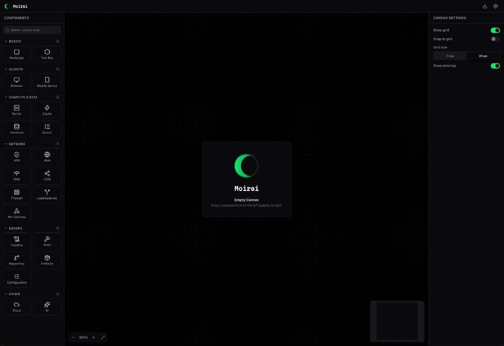

<p align="center">
  
</p>

<h1 align="center">Moirai</h1>

<p align="center">
  <strong>A modern, minimalist canvas for designing and communicating system architectures.</strong>
</p>

- [Overview](#overview)
- [Key Features](#key-features)
- [Architecture Review](#architecture-review)
- [The Use of AI](#the-use-of-ai)
- [Scaling Roadmap](#scaling-roadmap)
- [Getting Started](#getting-started)

---

## Overview



**Moirai** is a lightweight, local-first web application designed specifically for software engineers, systems architects, and technical leaders to draft, visualize, and communicate system designs with clarity and speed.

Drawing inspiration from minimalist drawing tools and structured diagramming suites, Moirai replaces cluttered generic drawing programs with a purpose-built workspace:
- **Clean Orthogonal Connections**: Crisp, 90-degree orthogonal edges that preserve diagram readability.
- **Architectural Primitives**: Standardized icons, boundary boxes (hexagonal/octagonal chamfered containers), and separator headers.
- **Design System Integrity**: Strict tokenized styling with zero ad-hoc color pollution, ensuring consistent visual clarity in both Light and Dark modes.

---

## Key Features

- 📐 **Orthogonal Arrow Routing**: Smart orthogonal connectors that snap at right angles with bidirectional arrows, custom labels, and clean aesthetics.
- 🗂️ **Structured Component Registry**: A single source of truth for architecture primitives across Clients, Compute & Data, Network, DevOps, Storage, and Custom groups.
- 📦 **Dynamic Boundary Boxes**: Grouping containers with chamfered geometry for VPCs, Kubernetes clusters, subnets, and trust boundaries.
- 🎨 **Unified Design System**: Fully responsive Light and Dark themes powered by centralized CSS custom properties.
- ⚡ **Local-First & Resilient**: Instant canvas state persistence in `localStorage`, full temporal undo/redo (`Ctrl+Z` / `Ctrl+Y`), and high-resolution PNG/SVG/JSON exports.
- 🔍 **Interactive Canvas**: Smooth infinite panning, responsive zooming, MiniMap overview, and snap-to-grid alignment.

---

## Architecture Review

Moirai is built with a modular, declarative, and decoupled frontend architecture engineered for high-performance interactive graph rendering and maintainability.

```
src/
├── config/
│   └── brand.ts               # Brand name, assets, and global metadata
├── theme/
│   ├── theme.css              # Central design tokens (CSS variables)
│   └── ThemeProvider.tsx      # Reactive theme manager (Light/Dark/System)
├── components/
│   ├── registry.ts            # Component catalog & metadata (single source of truth)
│   ├── layout/
│   │   ├── TopBar.tsx         # Brand header, actions, theme switcher
│   │   ├── LeftSidebar.tsx    # Categorized component palette & search
│   │   └── RightSidebar.tsx   # Contextual property inspector (nodes & edges)
│   └── canvas/
│       ├── Canvas.tsx         # React Flow canvas wrapper & drop targets
│       ├── nodes/             # Custom nodes (IconNode, BoxNode, SeparatorNode)
│       └── edges/             # Custom edges (OrthogonalEdge)
├── store/
│   └── diagramStore.ts        # Zustand store + Zundo temporal undo/redo
└── lib/
    ├── boxGeometry.ts         # Polygon point calculations & SVG math
    ├── exportImage.ts         # PNG/SVG rendering via html-to-image
    └── persistence.ts         # JSON import/export & storage schema handlers
```

### Core Architectural Layers

1. **Graph & Canvas Core (`@xyflow/react`)**:
   - Manages viewport transformations, node dragging, handle attachments, and DOM virtualization.
   - Node and edge types are strictly decoupled into dedicated React components (`IconNode`, `BoxNode`, `SeparatorNode`, `OrthogonalEdge`).

2. **State Management & Temporal History (`zustand` + `zundo`)**:
   - Centralized in `diagramStore.ts` to manage nodes, edges, selection state, and viewport data.
   - Wrapped with `zundo` middleware to provide frictionless multi-level undo and redo without polluting transient drag states.

3. **Single Source of Truth Component Registry (`registry.ts`)**:
   - Component definitions, default sizes, icon bindings, and palette groupings are defined once.
   - The palette sidebar and canvas renderers consume the same registry to prevent specification drift.

4. **Strict Tokenized Theming Engine (`theme.css`)**:
   - All colors and styling primitives are defined as CSS variables under `src/theme/theme.css`.
   - Enforced by a build-time script (`npm run check:colors`) that blocks hardcoded hex/RGB values across the codebase.

---

## The Use of AI

Moirai leverages Artificial Intelligence across two key dimensions: **how the application was engineered** and **how the product is evolving**.

### 1. Spec-Driven Agentic Engineering
Moirai was engineered through **AI pair programming and agentic workflows**:
- **Phase-Driven Specifications**: Features were implemented iteratively following formal architectural specifications (`docs/specs/`).
- **Automated Verification**: End-to-end browser automation, visual regression verification, and strict lint checks ensured that every phase satisfied UX and performance standards.
- **Consistent Code Quality**: Continuous validation against hard project rules (orthogonal routing, centralized registries, tokenized theming).

### 2. AI-Assisted Architecture Capabilities (Roadmap)
As Moirai scales, deep AI integrations are planned to transform static diagramming into an active architectural co-pilot:

- 💬 **Natural Language to Architecture (Text-to-Diagram)**:
  Generate end-to-end cloud and distributed system architectures from user requirements, user stories, or RFC documents.
- 🛡️ **Automated Architecture Review & Auditing**:
  Real-time AI analysis of canvas diagrams to identify:
  - Single points of failure (SPOFs) and missing redundancy.
  - Missing load balancing or caching layers under high throughput.
  - Security boundary violations, open public subnets, and unencrypted transport links.
- 📄 **Codebase & Cloud Reverse Engineering**:
  Parse Terraform configurations, AWS/GCP CDK scripts, and Kubernetes manifests to automatically generate up-to-date, editable Moirai diagrams.
- 🧠 **Smart Semantic Layout & Auto-Grouping**:
  AI-powered layout engines that understand architectural semantics (e.g., tier separation, database clusters, microservice meshes) to produce human-readable topologies automatically.

---

## Scaling Roadmap

Moirai is designed to scale from a focused personal diagramming tool into a comprehensive architecture platform:

- [ ] **Multi-Page & Hierarchical Canvases**: Drill down into microservices or sub-components directly from high-level architecture boxes.
- [ ] **Real-Time Multiplayer Collaboration**: Simultaneous multi-user editing with live cursors using CRDTs / WebSockets.
- [ ] **Diagrams-as-Code & Git Integration**: Two-way sync with Git repositories storing architecture diagrams as declarative JSON/YAML or Mermaid definitions.
- [ ] **Plugin & Icon Marketplace**: Community-contributed cloud provider packs (AWS, Azure, GCP, CNCF) and custom domain components.
- [ ] **Live Telemetry Overlays**: Connect diagrams to observability providers (Datadog, Prometheus, OpenTelemetry) to overlay live service health and latency.

---

## Getting Started

### Prerequisites
- Node.js (v18+ recommended)
- npm or pnpm / yarn

### Installation

```bash
# Clone the repository
git clone https://github.com/pablo-campos/moirai.git

# Navigate to project directory
cd moirai

# Install dependencies
npm install
```

### Development Scripts

```bash
# Start Vite development server
npm run dev

# Run TypeScript typecheck and build production bundle
npm run build

# Verify theme token compliance (ensures zero hardcoded color codes)
npm run check:colors

# Preview production build locally
npm run preview
```

---

## License

Private / Proprietary. All rights reserved.
